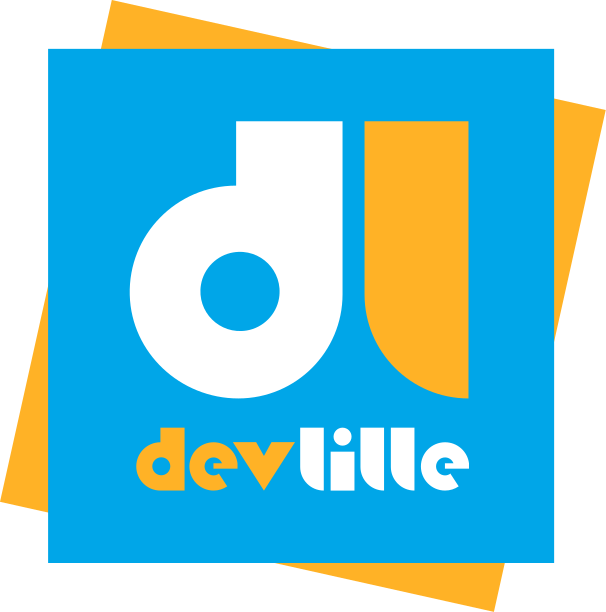
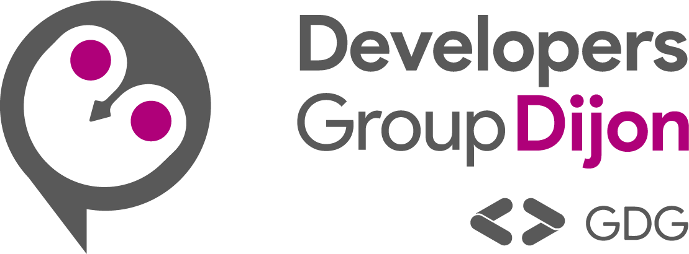

# Conference Hall

**Conference Hall** is an open SaaS platform to manage call for papers and speaker submissions for your conferences and meetups. Any speaker writes a talk once and can submit it to every event of the platform.

https://conference-hall.io

## Sponsors

[](https://devlille.fr)&nbsp;&nbsp;&nbsp;&nbsp;&nbsp;&nbsp;&nbsp;&nbsp;[](https://gdgnantes.com)&nbsp;&nbsp;&nbsp;&nbsp;&nbsp;&nbsp;&nbsp;&nbsp;[](https://developers-group-dijon.fr/)

## Features

**You are a speaker:**

- ✨ Write the abstract of your talk
- 🚀 Submit your talks to events (meetups and conferences)
- 🤝 Invite co-speakers to your talk
- 🔒 Social login

**You are an event organizer:**

- ❤️ Create your conference or meetup
- 📣 Call for papers opens and closes automatically
- ⚡️ Make it public or private
- 👥 Use teams to share an event between organizers
- 💡 Custom formats and categories for the talks
- 📥 Custom survey for speakers
- 📊 Dashboard and metrics on call for papers and reviews
- ⭐️ Review proposals
- 💬 Discussion between organizers about a proposal
- ✅ Mark proposals as accepted, declined...
- 💌 Publish result to speakers and notify them with emails
- 👌 Get speaker confirmations
- 📅 Build your conference schedule
- 📃 Export the proposals
- 🌍 Some integrations (Slack, API...)

## Development

If you want to contribute and make **Conference Hall** better, read our [Contributing Guidelines](./docs/contributing.md).

### Stack

React / React router v7 / Typescript / Tailwind / HeadlessUI / Conform / Zod / Prisma / Firebase Auth / Mailgun / Express / Postgresql / Redis / BullMQ / Oxlint / Oxfmt / Vitest / Playwright

### Prerequisites

- Docker
- Node 24+

### Getting started

Install dependencies:

```sh
npm install
```

Start Docker image for Postgres DB, Firebase emulators and Mailpit:

```sh
docker compose up
```

If you start **Conference Hall** for the first time, you need to run :

```sh
# Install pre-commit hook to ensure linting
npx lefthook install

# Setup and seed local DB
npm run db:reset
```

Start the development server:

```sh
npm run dev
```

### Useful commands

#### Generate Prisma client code

Need to be done when DB schema has changed

```sh
npm run db:reset
```

#### Reset and seed local DB

```sh
npm run db:reset
```

#### Execute tests

The docker image for Postgres DB, Redis and Firebase emulators MUST be running.

Install Playwright browser for components and e2e tests:

```sh
npx playwright install --with-deps chromium
```

Execute unit and integration tests:

```sh
npm run test
```

Execute end-to-end tests:

```sh
npm run test:e2e
```

#### Execute linting

```sh
npm run lint
```

#### Execute typecript check

```sh
npm run tsc
```

#### Export emulators data

```sh
docker exec -it ch_firebase_emulators sh
firebase --project=conference-hall emulators:export fixtures
```
